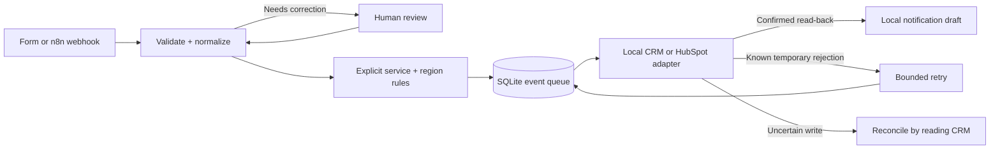

# Lead-to-CRM Automation

[English](README.md) · [简体中文](README.zh-CN.md)

**Turn website inquiries into an owned, traceable work queue.**

A small B2B service team receives requests through a form. Someone usually reads each message, copies contact details into a CRM, chooses an owner and follows up. This project makes that handoff visible: submit an inquiry, see which team owns it, inspect the contact update, and resolve anything that could not safely finish.

**Input:** contact details, request text, service, region and urgency. **Output:** a tracked event, one contact per email, an explained assignment and an internal notification draft. Invalid input and uncertain CRM outcomes stay visible for a person to handle.

> Personal portfolio demonstration with synthetic data, not paid client work. Local SQLite CRM is fully runnable. The HubSpot adapter and optional AI integration have **not been tested with live accounts**. The n8n export is structurally checked, but not executed in n8n. No messages are sent.


## Try it in five minutes

Requires Python 3.12+; no packages, database server or API keys are needed for local mode. Clone the [repository](https://github.com/myp81607-dot/lead-to-crm-automation), or download its ZIP and open a terminal in the extracted folder:

```sh
git clone https://github.com/myp81607-dot/lead-to-crm-automation.git
cd lead-to-crm-automation
python app.py
```

Open **http://127.0.0.1:8765**. In a second terminal, load seven synthetic examples:

```sh
python demo.py
```

Or choose **New inquiry → Fill sample → Submit inquiry**. A persistent SQLite database is created under `data/` and excluded from Git. Re-running `demo.py` replays the same IDs without creating extra events. Stop the server with Ctrl+C. Use `python app.py --db data/another-demo.db` for a fresh workspace.

## See the useful behavior

| Try this | What you can inspect |
| --- | --- |
| Submit a valid inquiry | A service/region owner, contact ID, original text, processing history and saved draft. |
| Replay that exact event | `duplicate: true`; no second CRM attempt or draft. |
| Use a new event ID with the same email | Another inquiry updates the existing contact; both inquiry histories remain. |
| Change service from automation to analytics | Assignment changes from Workflow team to Data team. Rules are in [rules.json](rules.json). |
| Submit an invalid email or choose “unsure” | A review item with reasons, zero CRM attempts, and an editable correction form. |
| Select local “timeout after write” | An uncertain result; **Verify CRM result** reads back the event marker and intended fields before completing. |
| Select local rate limit or credential failure | Due-time retry with at most three attempts, or an operator-blocked item. |

<details>
<summary>Real running screenshots: input and exception handling</summary>


</details>

[Watch the short browser recording](docs/demo.webm) · [90-second walkthrough](docs/demo.md)

## How it works



The Python backend owns validation, deduplication and recovery. The [n8n export](n8n/README.md) orchestrates webhook intake and due retries using the same API. This avoids two components independently retrying the same write. The English UI uses vanilla JavaScript and the API's actual stored results.

Event IDs deduplicate deliveries; normalized email deduplicates contacts. They are different keys. Reusing an event ID with different input returns HTTP 409. Unfinished writes for one contact are processed in order so an older retry cannot overwrite a later inquiry. After an interrupted write, restart moves the event to reconciliation instead of repeating it.

## Verification

```sh
python -m unittest discover -s tests -v
```

**23 tests passed on Python 3.12.14 / Windows**, including a 36-submission synthetic corpus: 34 distinct events, 2 exact replays, 29 completed events after retry/read-back recovery, 5 review items and 27 local contacts. The corpus's two replays introduced zero extra CRM attempts. Tests also cover input/rule changes, invalid fields, credential failures, bounded backoff, unknown outcomes, same-contact ordering and restart recovery. An earlier 22-test version also passed on Python 3.14.5. The committed test output records the final 23-test run.

These are deterministic behavior checks, **not AI classification accuracy or production reliability measurements**. HubSpot request shapes and AI failure handling are tested offline. No model was called; external model usage/cost was zero. See [actual test output](docs/test-results.txt), [synthetic inputs](examples/acceptance.json), and [integration details](docs/operations.md).

## Scope and tradeoffs

- Local-only, single-process demonstration. It has no production authentication, tenant isolation or public deployment setup. Run only one server per database.
- AI is off by default. With an explicitly configured compatible endpoint it offers an advisory summary/category; form fields still control routing. A failed model response is labeled unavailable. Live model quality is unverified.
- HubSpot mode requires an operator-provided test-account token. It writes contact name, email, company and description, including an event marker; it does not assign HubSpot owners or send notifications. Live account permissions and behavior remain unverified.
- A read-back mismatch stays unresolved. The tool never treats “not found” after a timeout as permission to create again. An operator must inspect the external CRM; there is no force-success button.
- Contacts hold the latest details, while each inquiry keeps its own input, route, correction history and draft. Email aliases are not merged. Notifications are local drafts only.
- n8n needs a same-host local instance. No cloud connection, container networking, live HubSpot test or video narration is included.

## What I implemented and referenced

Original implementation: persistent queue and state transitions, two distinct deduplication paths, contact sequencing, read-back recovery, rule explanations, correction UI, local fault simulator, optional adapters, tests, synthetic examples and n8n export. Developed with AI assistance; results above are from actual execution.

The public [n8n lead-capture template by Mohammad Abubakar](https://n8n.io/workflows/12374-capture-website-leads-to-hubspot-or-google-sheets-with-slack-follow-up/) informed the basic intake-to-follow-up flow. Official [n8n HubSpot documentation](https://docs.n8n.io/integrations/builtin/app-nodes/n8n-nodes-base.hubspot/) and [HubSpot Contacts documentation](https://developers.hubspot.com/docs/api-reference/legacy/crm/objects/contacts/guide) informed integration boundaries and email lookup. No template JSON or third-party code was copied; [reference and license notes](docs/references.md) explain the specific borrowings. Original code is [MIT licensed](LICENSE).

**Portfolio summary:** A runnable inquiry-to-contact workflow with duplicate handling, human review and failure recovery, demonstrated on synthetic data. Suitable as a starting point for a scoped form-to-CRM integration; no client results or commercial savings are claimed.
