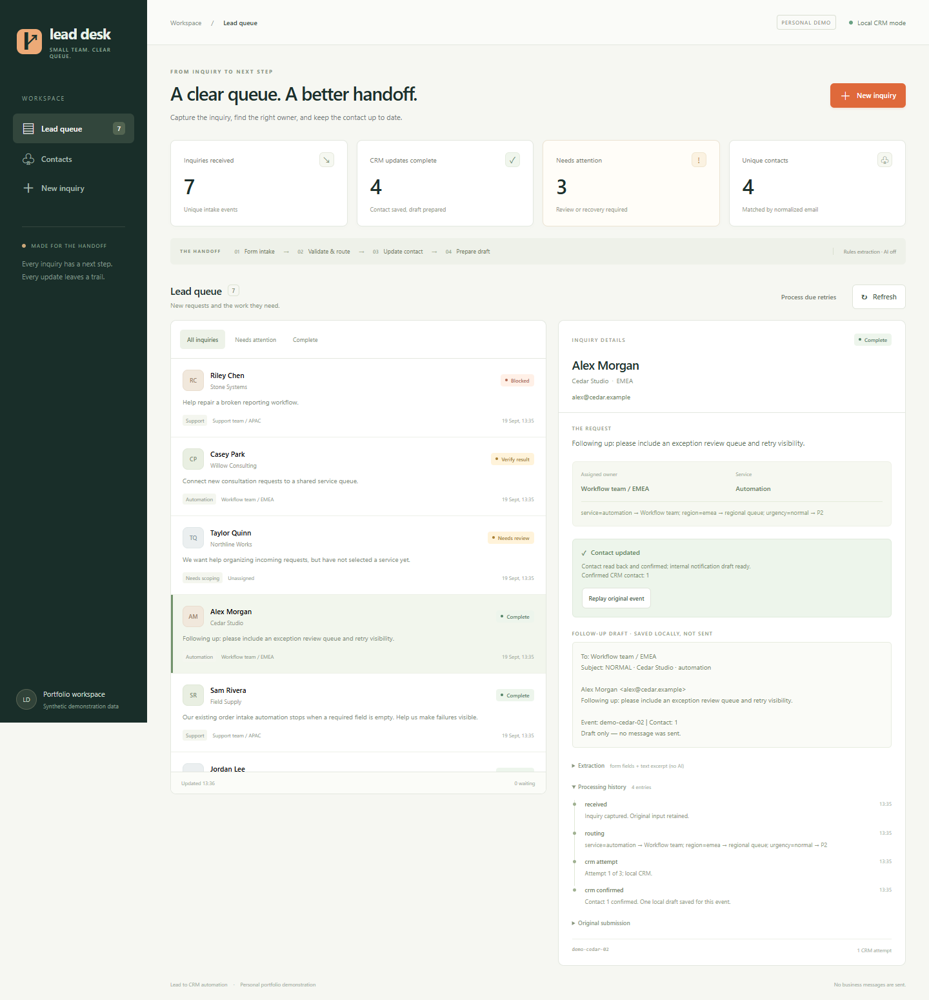

# Lead intake and CRM updates

[English](README.md) · [简体中文](README.zh-CN.md)

A small service team needs somewhere to put website inquiries, assign follow-up and check which contact details are current. This application gives each inquiry its own history while keeping one contact per email.

Form or n8n webhook → validate and assign → update the contact, or leave a clear review task.

[58-second walkthrough](docs/demo.webm) · [Old inquiry review](docs/review-update.webm) · [Screenshot](docs/screenshots/02-output.png). GitHub offers the recordings as downloads; choose **View raw** to save and open them. The first recording shows the original layout, with the same intake and recovery behavior. The review clip shows the current layout and the fix below.

This is a personal project using fictional inquiries. Python and the local SQLite CRM run without accounts or API keys. The workflow was imported and run with n8n 2.39.8, including its scheduled retry; see the [setup and execution results](n8n/README.md). HubSpot and the optional model interface have not been tested with live accounts; notifications are saved drafts, not sent messages.

**Validation:** all 29 tests passed on Ubuntu 24.04 / Python 3.12.14 with `python -m unittest discover -s tests -v`. [Successful CI run](https://github.com/myp81607-dot/lead-to-crm-automation/actions/runs/35426756353), tested commit [`f1f7d80df760ffd811979924f571ce6f5a0cb95d`](https://github.com/myp81607-dot/lead-to-crm-automation/commit/f1f7d80df760ffd811979924f571ce6f5a0cb95d).

It is intended for a scoped form-to-CRM integration or a repair to an existing intake workflow. To adapt it for a team, start with a sample inquiry, the target contact fields, routing rules and an authorized test environment.



## Run it locally

Install Python 3.12 or later. [Download the repository ZIP](https://github.com/myp81607-dot/lead-to-crm-automation/archive/refs/heads/main.zip), extract it, and open a terminal in the extracted directory. No Python package installation is required.

```sh
python app.py
```

Open [localhost:8765](http://127.0.0.1:8765). Choose **New inquiry → Fill sample → Submit inquiry**, or load the seven supplied examples from another terminal:

```sh
python demo.py
```

The examples include an invalid email, an unclassified request, a simulated credential failure and a write whose result needs checking. Run the command again to see exact event replays without new records. Data stays in `data/leads.db`, which is excluded from Git. Ctrl+C stops the server; `python app.py --db data/fresh.db` starts with a separate database.

## Use your own inquiry and rules

Copy [examples/lead.json](examples/lead.json) to `data/my-inquiry.json`. Replace the details with data you have permission to process, choose a service and region, and give each new inquiry a new `event_id`. Keep the ID and exact payload when retrying the same delivery.

```sh
curl -X POST http://127.0.0.1:8765/api/leads -H "Content-Type: application/json" --data-binary @data/my-inquiry.json
```

On Windows use `curl.exe`, or the PowerShell command in [operations.md](docs/operations.md). Change the team names in [rules.json](rules.json), then submit a new inquiry. For example, replacing `"automation": "Workflow team"` with `"automation": "Intake team"` assigns the next automation request to Intake team. Earlier histories keep their original assignment.

For n8n, follow the [same-host setup](n8n/README.md). It imports the supplied workflow and calls the same API. Python owns duplicate handling and retries; n8n supplies the webhook and the minute-by-minute retry trigger.

## When an inquiry needs attention

| What you see | What to do |
| --- | --- |
| Needs review | Correct missing or invalid fields and submit the correction. The original submission remains in its history. |
| Filed · contact unchanged | A newer inquiry has updated the same email, or has an uncertain CRM result. The old request is assigned and retained, but its details are not written over the newer request. Open the linked inquiry or current contact details. |
| Retry scheduled | Wait until the due time. The n8n schedule, or **Process due retries**, advances it. A CRM step has at most three attempts. |
| Verify result | **Verify CRM result** reads the CRM and checks the event marker and intended fields. A mismatch stays unresolved; no write is repeated. |
| Blocked | Inspect the credential/configuration error or exhausted retry count before another action. Bad credentials are not retried automatically. |

An older request waiting for review does not stop a new valid request. Correcting the old request later also does not make its contact details current. Receipt order decides that, including when the correction changes its email to an existing contact.

## What has been checked

The review-ordering bug was reproduced with `Old company / unsure → New company / automation → correct only the old service`. Before the fix, the contact reverted to Old company. It now keeps the newer company, description and event ID, while the old inquiry is filed without a CRM write.

The complete 29-test CI run linked above includes six review tests alongside the original 23 tests. The review and sequencing checks cover a corrected email matching a newer contact, ordinary correction, a different email, a newer uncertain write, restart recovery and retry order. Run the complete suite with:

```sh
python -m unittest discover -s tests -v
```

[Historical test output](docs/test-results.txt) retains the earlier 23-test baseline and the six review tests plus two existing sequencing tests run during the fix on Windows / Python 3.14.5. The baseline's 36 synthetic submissions produced 34 events, 29 completed after recovery, 5 review items and 27 contacts; those are fixture behavior checks, not production or model accuracy figures.

Real n8n checks, versions and the repeatable command are in [n8n/README.md](n8n/README.md). Timeouts and rate limits in local CRM mode are explicit simulations. No paid inference, live HubSpot write or real notification was performed.

## Before using an external CRM

Run one process per database on your local machine. Public hosting, authentication, multiple teams and retention policies are outside this version. The backend binds to loopback and should not be exposed as an unauthenticated public service.

The HubSpot adapter replaces contact name, company and description with the accepted inquiry's values; the description includes an event marker. It does not assign HubSpot owners. Agree field mapping and obtain an authorized test account before enabling it. [Operations and API details](docs/operations.md) cover the token environment variable, read-back behavior, failures and optional advisory model configuration.

The code and small n8n export were written for this project, with AI-assisted development. The public n8n lead-capture template informed the basic flow; official n8n and HubSpot documentation informed the integration. No template code was copied. See [references and license notes](docs/references.md); original code is [MIT licensed](LICENSE).
