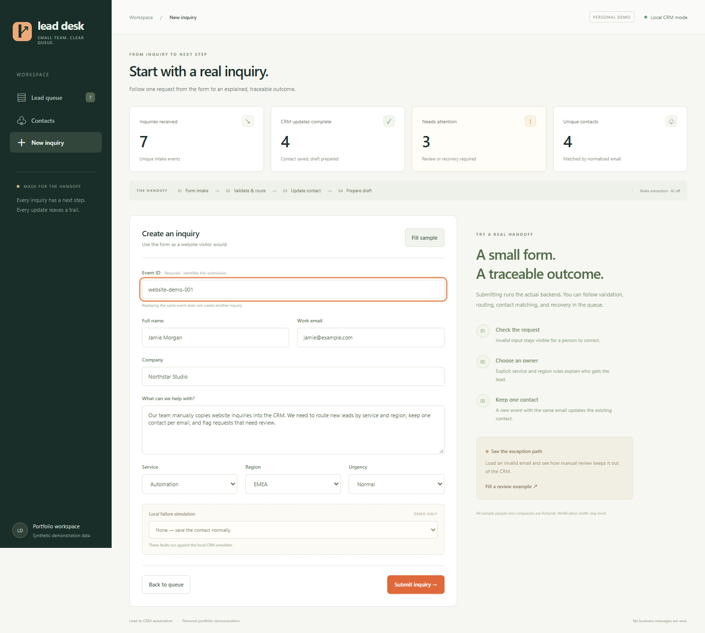
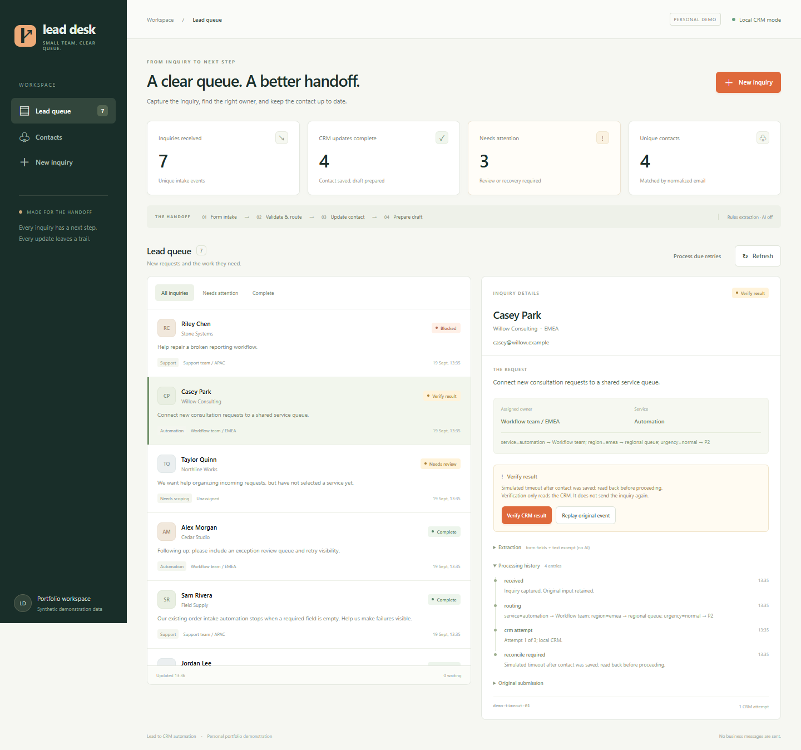
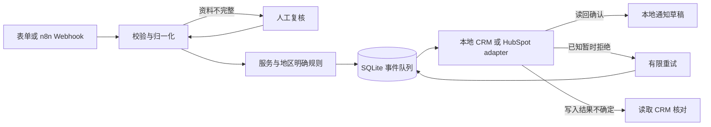

# 表单咨询到 CRM 的自动化处理

[English](README.md) · [简体中文](README.zh-CN.md)

**把网站咨询变成有人负责、能够追踪的处理队列。**

小型 B2B 服务团队收到表单咨询后，通常要人工读消息、复制联系人信息、分配负责人，再准备内部跟进。这个项目把这些步骤串起来：提交咨询后，可以看到谁负责、联系人更新了什么，以及哪些事情还需要人工处理。

**输入：**联系人资料、咨询原文、服务类别、地区和紧急程度。**输出：**处理记录、按邮箱合并的联系人、有理由的分配结果，以及内部通知草稿。资料不完整或 CRM 写入结果不确定时，会明确进入待处理队列。

> 使用合成数据的个人作品演示，不是付费客户案例。本地 SQLite CRM 可完整运行。HubSpot adapter 和可选 AI 接口**尚未实连验证**；n8n 导出已做结构检查，尚未在 n8n 中执行。系统不会发送真实消息。


## 五分钟启动

需要 Python 3.12+。本地模式不需要安装第三方包、数据库服务或填写 API 密钥。下载本仓库后，在解压得到的仓库目录打开终端：

```sh
python app.py
```

打开 **http://127.0.0.1:8765**。另开一个终端，载入 7 条合成演示咨询：

```sh
python demo.py
```

也可以点击 **New inquiry → Fill sample → Submit inquiry** 自己提交。数据保存在 `data/` 下的 SQLite 数据库，不会进入 Git。重复运行 `demo.py` 会识别已有事件，不新增相同记录。Ctrl+C 停止；使用 `python app.py --db data/another-demo.db` 可以开始一个全新的演示库。

## 可以直接验证的价值

| 操作 | 可观察结果 |
| --- | --- |
| 提交有效咨询 | 查看分配团队、联系人 ID、原文、处理历史和通知草稿。 |
| 重放完全相同的事件 | 返回 `duplicate: true`，不重复写 CRM 或生成额外草稿。 |
| 同一邮箱、使用新事件 ID 再咨询 | 更新已有联系人，同时保留两次咨询的独立记录。 |
| 服务从 automation 改为 analytics | 从 Workflow team 改分配到 Data team；规则见 [rules.json](rules.json)。 |
| 邮箱非法，或选择 unsure | 显示具体复核原因，CRM 尝试次数为零，可人工修正后处理。 |
| 选择本地“写入后超时”故障 | 显示结果不确定；点击 **Verify CRM result** 读回事件标记及字段，核对成功后才完成。 |
| 模拟限流或凭据失效 | 按到期时间重试且最多三次，或阻止自动重试并提示人工处理。 |

<details>
<summary>更多真实运行截图：输入与异常处理</summary>




</details>

[浏览器操作短录像](docs/demo.webm) · [90 秒演示步骤](docs/demo.md)

## 实现方式



Python 后端统一管理校验、去重和恢复；[n8n 工作流](n8n/README.md) 负责 Webhook 接入与周期性触发到期重试，调用同一套 API。英文界面使用原生 JavaScript，显示后端真实保存的结果。

事件 ID 用来识别重复投递，归一化邮箱用来合并联系人，两者分开实现。同一事件 ID 携带不同内容返回 HTTP 409。同一联系人的未完成写入按顺序执行，避免旧请求重试覆盖后来的咨询。进程在写入中断开后，重启会要求先核对，而不是盲目重发。

## 实际验证

```sh
python -m unittest discover -s tests -v
```

在 **Windows / Python 3.12.14 上，23 项测试通过**，包含 36 次合成咨询提交：34 个独立事件、2 次完全相同的重放；重试与读回恢复后 29 个完成、5 个待复核、27 个本地联系人。两次重放没有增加 CRM 尝试。还覆盖了输入/规则变化、非法字段、凭据失效、有限退避、不确定结果、同一联系人的顺序和重启恢复。此前的 22 项测试版本也在 Python 3.14.5 上通过；仓库保存的是最终 23 项测试输出。

这些是确定性行为测试，**不是 AI 分类准确率或生产可靠性指标**。HubSpot 请求协议和 AI 故障处理只做了离线验证，未调用真实模型，外部模型用量与费用为零。详见 [测试原始输出](docs/test-results.txt)、[合成输入](examples/acceptance.json)、[运行与接口说明](docs/operations.md)。

## 范围与局限

- 单机、单进程、仅监听本地回环地址；没有生产鉴权、多租户隔离或公网部署配置。每个数据库只运行一个服务进程。
- AI 默认关闭；显式配置兼容接口后，只提供摘要和类别建议，分配仍依据表单字段。调用失败标为不可用，真实模型质量尚未验证。
- HubSpot 模式由操作者提供获授权测试账户令牌，写入姓名、邮箱、公司和包含事件标记的 description。团队分配仅保存在本地，不修改 HubSpot owner，不发送通知。真实权限和账户行为待验证。
- 超时后的读回不匹配会保持未解决，查不到联系人也不会自动再次创建。需人工检查外部 CRM，没有“强制成功”按钮。
- 联系人保存最新资料，每次咨询保留原文、分配、修正记录与草稿。不合并邮箱别名，通知始终只是本地草稿。
- n8n 需要同一主机网络内的本地实例；未配置云连接或容器网络。未执行真实 HubSpot 测试；短录像无配音。

## 本人实现与参考来源

原创实现包含持久化队列、状态转换、两类去重、联系人写入顺序、读回恢复、规则解释、人工修正界面、本地故障模拟、可选接口、测试、合成样例及 n8n 导出。开发使用了 AI 辅助；上述验证结论来自实际执行。

参考 [Mohammad Abubakar 的 n8n 表单线索模板](https://n8n.io/workflows/12374-capture-website-leads-to-hubspot-or-google-sheets-with-slack-follow-up/) 的接入到跟进流程，以及官方 [n8n HubSpot 节点文档](https://docs.n8n.io/integrations/builtin/app-nodes/n8n-nodes-base.hubspot/) 和 [HubSpot Contacts 文档](https://developers.hubspot.com/docs/api-reference/legacy/crm/objects/contacts/guide) 的集成边界与邮箱查询方式。未复制模板 JSON 或第三方代码；[来源与许可证说明](docs/references.md) 逐项列出了实际借鉴内容。原创代码使用 [MIT 许可证](LICENSE)。

**作品简介：**一个可本地运行的表单咨询处理工具，展示联系人更新、重复投递处理、人工复核与故障恢复。适合作为小范围表单到 CRM 集成的演示起点，不宣称未发生的客户效果或经济收益。
