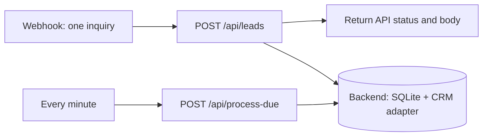

# n8n orchestration

[Back to the project](../README.md) · [中文项目说明](../README.zh-CN.md)

The workflow forwards a form submission to the local lead service and returns the service's actual result. A second branch asks the service to process due retries every minute. The lead service owns all business rules and durable state, so the UI and n8n use the same behavior.

Tested on 2026-09-19 with n8n 2.39.8, Node 24.19.0 and the Python service on the same Windows host. The submitted JSON was imported, published and executed through the production webhook. LocalCRM contact creation, updates, read-back and a real scheduled retry passed. HubSpot remains unconnected; the rate-limit fault was injected by LocalCRM. Notifications remain local drafts. No cloud or model credentials were used.



## Start on one computer

Keep the Python service and n8n on the same host. The workflow calls `127.0.0.1:8765`; that address would refer to the container itself in Docker, so these instructions use a local npm installation. The backend stays on loopback. A cloud tunnel is not needed.

Use Node 24 LTS. Install the tested n8n version from the repository root; this keeps packages and n8n's private database in the existing ignored `data/` folder:

```sh
npm install --prefix data/n8n-runtime n8n@2.39.8
```

Start the Python service in a separate terminal using the [project quick start](../README.md). Then start n8n in PowerShell:

```powershell
$env:N8N_USER_FOLDER = "$PWD/data/n8n-state"
$env:N8N_LISTEN_ADDRESS = '127.0.0.1'
$env:N8N_HOST = '127.0.0.1'
$env:N8N_SECURE_COOKIE = 'false'
$env:WEBHOOK_URL = 'http://127.0.0.1:5678/'
$env:N8N_DIAGNOSTICS_ENABLED = 'false'
node data/n8n-runtime/node_modules/n8n/bin/n8n start
```

Or in bash:

```sh
export N8N_USER_FOLDER="$PWD/data/n8n-state"
export N8N_LISTEN_ADDRESS=127.0.0.1 N8N_HOST=127.0.0.1
export N8N_SECURE_COOKIE=false WEBHOOK_URL=http://127.0.0.1:5678/
export N8N_DIAGNOSTICS_ENABLED=false
node data/n8n-runtime/node_modules/n8n/bin/n8n start
```

The cookie setting is for this loopback HTTP session. Open [local n8n](http://127.0.0.1:5678) and create its local owner login. No n8n Cloud account, trial, activation key, CRM account or model is needed. Retain the same `N8N_USER_FOLDER` each time you restart. Stop n8n with Ctrl+C. The tested release still accepts `WEBHOOK_URL` but recommends its replacement `N8N_WEBHOOK_URL` for future setups. npm installation is deprecated from n8n 3.0; this guide pins the local version actually tested.

## Import and connect

1. Start the lead service using the [project quick start](../README.md). It listens on port `8765`.
2. In your existing local n8n instance, use **Import from File** to import [lead-intake.json](lead-intake.json). The export is inactive.
3. Open both HTTP Request nodes and confirm their URLs. `127.0.0.1` requires n8n and the backend to share the same host network. This backend deliberately binds only to loopback and has no public bind option. Separate container networking and n8n Cloud are not configured or supported by this demo; use a same-host local n8n instance. No cloud tunnel is included.
4. Open **Receive lead**, select its test URL and click **Listen for test event**. The supplied webhook path is `lead-intake-demo`; copy the exact URL shown by your n8n instance.
5. Send the request below, then inspect **Return actual result** and the local dashboard. A successful HTTP request does not by itself mean CRM synchronization completed: inspect `event.status`.
6. To enable the production webhook URL and periodic branch, save and publish the workflow. When starting an already-published workflow, wait for **Activated workflow** in the terminal before sending requests; the health endpoint can become available earlier. Keep this unauthenticated demo on loopback. Stop it by unpublishing the workflow or stopping n8n.

This export uses Webhook v2, HTTP Request v4.2, Respond to Webhook v1.4 and Schedule Trigger v1.2. These are **node type versions**, not an n8n application version compatibility claim. If your instance reports an unavailable node version, update the relevant nodes in the editor and perform the checks below before relying on the workflow.

## Try a normal inquiry and a failure

From the repository root, replace the URL if your instance uses a different one:

```sh
curl -i -X POST http://localhost:5678/webhook-test/lead-intake-demo \
  -H "Content-Type: application/json" \
  --data-binary @n8n/example-lead.json
```

PowerShell users can call `curl.exe` on one line, or use:

```powershell
Invoke-RestMethod -Method Post -Uri 'http://localhost:5678/webhook-test/lead-intake-demo' -ContentType 'application/json' -InFile 'n8n/example-lead.json'
```

The file contains synthetic data. Use these changes to explore how the intake behaves:

| Change | Expected observation |
| --- | --- |
| First send | API response contains `event` and `duplicate: false`; inspect the event in the dashboard. |
| Send the exact file again | `duplicate: true`; a confirmed operation is not repeated. Re-arm the test listener before each test call if needed. |
| Change `company` but keep the same `event_id` | HTTP `409`, because an event ID cannot silently acquire different input. |
| Change `event_id` to `n8n-demo-002` while keeping the email | New event; the same contact is eligible for update. |
| Send an empty JSON object | HTTP `422` for a malformed envelope, not a success message. |
| Use a new event ID and an invalid email | A stored event with reasons for human review; no claimed CRM success. |
| Stop the backend and submit | The HTTP Request node fails; n8n returns an execution error, never a fabricated success. |

For repeatable tests without repeatedly arming the test listener, use the production URL shown by n8n after publishing/activating this **private local** workflow. Do not publish the webhook to the internet as part of this demo.

After publishing, this standard-library script sends fresh synthetic requests through the production webhook and reads the resulting contacts from the backend:

```sh
python n8n/check_webhook.py
```

It checks creation, exact replay, `409`, `422`, a same-email contact update and the `rate_limit_once` recovery. It waits up to 100 seconds for the minute schedule; leave both services running and do not click **Process due retries** or retry the event manually during this check. The script prints the event IDs. Open n8n **Executions** and inspect the corresponding scheduled run: its nodes should be **Every minute → Process due work**, with `processed: 1`. That execution is the evidence that n8n, rather than another caller, started the retry. The injected `429` belongs to LocalCRM; it is not a real HubSpot rate-limit test.

Use `--webhook URL` if your n8n port differs. The script accepts loopback URLs only and requires LocalCRM mode. The workflow's two backend URLs and the script's `--backend URL` must agree if you change the Python port. n8n's label “production webhook” means its persistent URL; this remains a local personal demo.

For your own form, start with [example-lead.json](example-lead.json), replace its synthetic contact fields and use one stable `event_id` per submission. A retry keeps the same ID and entire payload. A genuinely new inquiry gets a new ID, even when the email is unchanged. Team names are configured in the backend's `rules.json`; the workflow does not maintain a second routing table.

If a call fails, check these in order:

| Symptom | What to check |
| --- | --- |
| n8n `404`, webhook not registered | Publish the workflow and use `/webhook/lead-intake-demo`, or arm the temporary test listener before using `/webhook-test/…`. |
| Connection refused in an HTTP node | Python must still be running on the same computer at `127.0.0.1:8765`. |
| `retry_wait` stays pending | The workflow must be published and n8n running. Inspect the scheduled execution and its HTTP-node error. |
| `409` | Inspect the existing event. Keep its exact payload for a replay or assign a new ID for a new inquiry. |
| HTTP `200` with `needs_review` | The inquiry was saved but needs correction in the backend UI; HTTP delivery succeeded, CRM processing did not. |

To follow the verified [Server CLI](https://docs.n8n.io/deploy/host-n8n/configure-n8n/use-the-command-line) path, stop n8n and run these commands from the repository root, keeping the same `N8N_USER_FOLDER` environment setting:

```sh
node data/n8n-runtime/node_modules/n8n/bin/n8n import:workflow --input=n8n/lead-intake.json
node data/n8n-runtime/node_modules/n8n/bin/n8n publish:workflow --id=lead-intake-local-demo
```

Then restart n8n so trigger registration uses the imported/published version. The export includes a stable workflow ID because n8n 2.39.8's file importer rejected the original ID-less file. Reimporting with the CLI updates that ID: use a fresh local instance for this demo, or check the destination before importing into an existing one.

## Recorded execution

One run of `python n8n/check_webhook.py` used the synthetic event prefix `n8n-e2d27903253c`. All six checks passed. n8n's saved execution data was also read to confirm the trigger and HTTP-node outputs:

| n8n execution | Observed result |
| --- | --- |
| 1 — create | HTTP `200`, `completed`, contact `8`, `duplicate: false`. |
| 2 — replay | HTTP `200`, `duplicate: true`, no extra CRM attempt. |
| 3 — collision | HTTP `409` and the backend's error body reached the caller. |
| 4 — invalid envelope | HTTP `422` and the backend's error body reached the caller. |
| 5 — update | New event, same contact `8`; company, message and last event were read back with the new values. |
| 6 → 7 — retry | First attempt returned `retry_wait`. Execution `7`, mode `trigger`, ran **Every minute → Process due work** at `2026-09-19 06:24:07 UTC`, returned `processed: 1`; the event completed on attempt 2 after 12.1 seconds. No manual retry or process-due call was made. |

Executions 3 and 4 appear as `success` in n8n because the workflow successfully relayed the API error; the caller still received `409` and `422`. These local IDs identify this demonstration run, not an external customer environment. The setup used Server CLI import/publish and direct HTTP requests. The editor was opened at its initial local-account setup page; editor login and file-picker import were not used for this verification.

The startup log also reported a missing internal n8n Python runner environment. This workflow has no Python Code node: its Python application is a separate HTTP service, and the verified branches completed without that runner. Docker networking, n8n Cloud, backend-outage behavior through n8n and live HubSpot requests were not tested in this run.

## Response and retry contract

- `POST /api/leads` receives one object containing `event_id`, `name`, `email`, `company`, `message`, `service`, `region`, and `urgency`. It forwards the request body unchanged, so validation remains in one place.
- Service values: `automation`, `analytics`, `support`, `unsure`. Regions: `americas`, `emea`, `apac`. Urgency: `normal`, `urgent`.
- HTTP `200` means the inquiry was stored, including inquiries that need review or recovery. The body is `{ "event": { ... }, "duplicate": false }`, with `duplicate: true` for a recognized replay. HTTP `409` identifies an event ID collision; HTTP `422` identifies an invalid envelope.
- **Submit to lead service** includes the response status and uses **Never Error** only to pass through non-2xx responses to the caller. **Return actual result** mirrors `statusCode` and `body`. Transport errors still fail the execution.
- `POST /api/process-due` receives `{}` and returns `{ "processed": n }` for one bounded pass. `processed` is a count of work processed, not proof every CRM operation succeeded. Inspect event details for outcomes. A failed scheduled HTTP call is visible in n8n execution history.
- n8n node retries are disabled. The backend controls retry eligibility, due times, bounds, and reconciliation of uncertain external results. Do not add a second retry loop around CRM writes.
- If the caller loses the response, it must retain the original `event_id` and exact payload when resubmitting. A network failure is not proof that nothing was stored. Use the dashboard or `GET /api/events/{event_id}` to inspect the recorded event; `GET /api/events` lists events.

## Scope

This workflow does not directly create a HubSpot contact or send a Slack/email message. The backend's configured adapter owns CRM writes; notifications remain local drafts. The native HubSpot node was evaluated as a reference, but moving writes into the workflow would split the retry and reconciliation logic. The [reference notes](../docs/references.md) explain what was borrowed conceptually and what is original.

Installation and CLI steps follow n8n's [npm installation](https://docs.n8n.io/deploy/host-n8n/install-options/install-with-npm) and [Server CLI documentation](https://docs.n8n.io/deploy/host-n8n/configure-n8n/use-the-command-line), checked on 2026-09-19. n8n itself retains its own [license](https://github.com/n8n-io/n8n/blob/master/LICENSE.md); this repository does not redistribute its packages.
