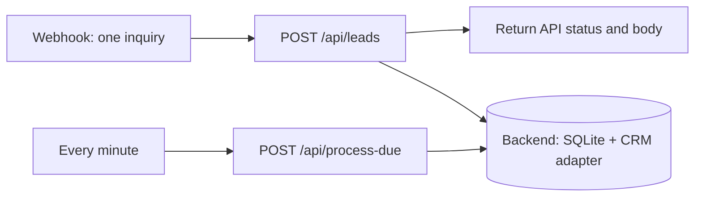

# n8n orchestration

[Back to the project](../README.md) · [中文项目说明](../README.zh-CN.md)

The workflow forwards a form submission to the local lead service and returns the service's actual result. A second branch asks the service to process due retries every minute. The lead service owns all business rules and durable state, so the UI and n8n use the same behavior.

**Verification:** the export was parsed and its graph and node parameters checked against the official n8n node definitions. It has **not been imported or executed in n8n**. Backend test results are documented separately in the project README. No n8n Cloud, HubSpot, Slack or model credentials are included.



## Import and connect

1. Start the lead service using the [project quick start](../README.md). It listens on port `8765`.
2. In your existing local n8n instance, use **Import from File** to import [lead-intake.json](lead-intake.json). The export is inactive.
3. Open both HTTP Request nodes and confirm their URLs. `127.0.0.1` requires n8n and the backend to share the same host network. This backend deliberately binds only to loopback and has no public bind option. Separate container networking and n8n Cloud are not configured or supported by this demo; use a same-host local n8n instance. No cloud tunnel is included.
4. Open **Receive lead**, select its test URL and click **Listen for test event**. The supplied webhook path is `lead-intake-demo`; copy the exact URL shown by your n8n instance.
5. Send the request below, then inspect **Return actual result** and the local dashboard. A successful HTTP request does not by itself mean CRM synchronization completed: inspect `event.status`.
6. To enable the production webhook URL and periodic branch, save and publish/activate the workflow in your n8n version. Keep this unauthenticated demo on a private local network. Stop it by unpublishing/deactivating the workflow.

This export uses Webhook v2, HTTP Request v4.2, Respond to Webhook v1.4 and Schedule Trigger v1.2. These are **node type versions**, not an n8n application version compatibility claim. If your instance reports an unavailable node version, update the relevant nodes in the editor and perform the checks below before relying on the workflow.

## Try a normal inquiry and a failure

From the repository root, replace the URL if your instance uses a different one:

```sh
curl -i -X POST http://localhost:5678/webhook-test/lead-intake-demo \
  -H "Content-Type: application/json" \
  --data-binary @n8n/example-lead.json
```

PowerShell users can call `curl.exe` on one line, or use:

```powershell
Invoke-RestMethod -Method Post -Uri 'http://localhost:5678/webhook-test/lead-intake-demo' -ContentType 'application/json' -InFile 'n8n/example-lead.json'
```

The file contains synthetic data. These are **expected acceptance checks to run in your n8n instance**, not a report of completed n8n execution:

| Change | Expected observation |
| --- | --- |
| First send | API response contains `event` and `duplicate: false`; inspect the event in the dashboard. |
| Send the exact file again | `duplicate: true`; a confirmed operation is not repeated. Re-arm the test listener before each test call if needed. |
| Change `company` but keep the same `event_id` | HTTP `409`, because an event ID cannot silently acquire different input. |
| Change `event_id` to `n8n-demo-002` while keeping the email | New event; the same contact is eligible for update. |
| Send an empty JSON object | HTTP `422` for a malformed envelope, not a success message. |
| Use a new event ID and an invalid email | A stored event with reasons for human review; no claimed CRM success. |
| Stop the backend and submit | The HTTP Request node fails; n8n returns an execution error, never a fabricated success. |

For repeatable tests without repeatedly arming the test listener, use the production URL shown by n8n after publishing/activating this **private local** workflow. Do not publish the webhook to the internet as part of this demo.

## Response and retry contract

- `POST /api/leads` receives one object containing `event_id`, `name`, `email`, `company`, `message`, `service`, `region`, and `urgency`. It forwards the request body unchanged, so validation remains in one place.
- Service values: `automation`, `analytics`, `support`, `unsure`. Regions: `americas`, `emea`, `apac`. Urgency: `normal`, `urgent`.
- HTTP `200` means the inquiry was stored, including inquiries that need review or recovery. The body is `{ "event": { ... }, "duplicate": false }`, with `duplicate: true` for a recognized replay. HTTP `409` identifies an event ID collision; HTTP `422` identifies an invalid envelope.
- **Submit to lead service** includes the response status and uses **Never Error** only to pass through non-2xx responses to the caller. **Return actual result** mirrors `statusCode` and `body`. Transport errors still fail the execution.
- `POST /api/process-due` receives `{}` and returns `{ "processed": n }` for one bounded pass. `processed` is a count of work processed, not proof every CRM operation succeeded. Inspect event details for outcomes. A failed scheduled HTTP call is visible in n8n execution history.
- n8n node retries are disabled. The backend controls retry eligibility, due times, bounds, and reconciliation of uncertain external results. Do not add a second retry loop around CRM writes.
- If the caller loses the response, it must retain the original `event_id` and exact payload when resubmitting. A network failure is not proof that nothing was stored. Use the dashboard or `GET /api/events/{event_id}` to inspect the recorded event; `GET /api/events` lists events.

## Scope

This workflow does not directly create a HubSpot contact or send a Slack/email message. The backend's configured adapter owns CRM writes; notifications remain local drafts. The native HubSpot node was evaluated as a reference, but moving writes into the workflow would split the retry and reconciliation logic. The [reference notes](../docs/references.md) explain what was borrowed conceptually and what is original.
